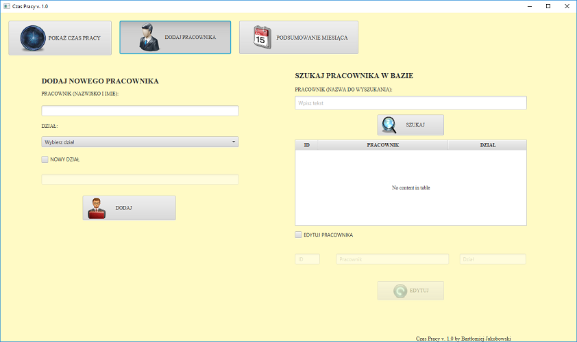
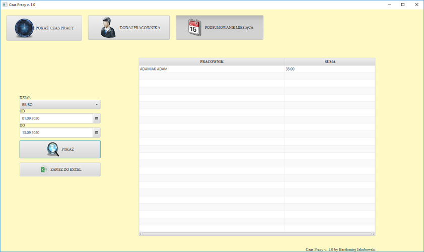

# Czas pracy
> Ewidencja czasu pracy.

## Opis aplikacji

Aplikacja pozwala na zapisywanie godzin przebytych w pracy pracowników.
Na podstawie wprowadzonych informacji można wygenerować zestawienie dla danego pracownika lub działu.
System zapisuje informacjie w bazie danych o rekordach usuniętych oraz zmodyfikowanych.

## Użyte technologie
* Java - 1.8
* JavaFX
* Apache POI - 4.0.1
* MySQL
* PLSQL

## Opis uruchomienia

Przed uruchomieniem aplikacji należy uruchumić dowolny server db (osobiście użyłem MySQL v. 8.0.12).
Nastęnie należy stworzyć nową bazę danych o dowolnej nazwie (moja nazwa czas_pracy) oraz 3 tabele wedlug poniższego schematu:

W klasie sample.database.ConnectionHelper należy podać wszystkie infomracjie o połączeniu do bazy danych(adres, nazwa bazy danych, haslo i login).

## Skryp

Skrypt odpowiedzialny za zapisanie rekordu, który został zmodyfikowany w oddzielnej tabeli.

* Trigger w przypadku skasowania danych:

<pre>
delimiter //
CREATE TRIGGER trg_delete_godziny
BEFORE DELETE ON godziny
FOR EACH ROW
BEGIN
INSERT INTO godziny_arch values ( sysdate(), old.id_pracownik, old.data_wejscie, 
old.wejscie, old.wyjscie,old.czas_pracy, old.stawka, old.nieobecnosc, 'delete');
END; //
</pre>

W tablei godziny_arch są zapisywane informacje, które zostały skasowane z ewidencji wraz z adnotacją "delete".

* Trigger w przypadku modyfikowania danych:

<pre>
delimiter //
CREATE TRIGGER trg_update_godziny
BEFORE UPDATE ON godziny
FOR EACH ROW
BEGIN
IF old.wejscie != new.wejscie then
SET
@wejscie = old.wejscie;
ELSE
SET
@wejscie = NULL;
END IF;
IF old.wyjscie != new.wyjscie then
SET
@wyjscie = old.wyjscie;
ELSE
SET
@wyjscie = NULL;
END IF;
IF old.czas_pracy != new.czas_pracy then
SET
@czas_pracy = old.czas_pracy;
ELSE
SET
@czas_pracy = NULL;
END IF;
IF old.stawka != new.stawka then
SET
@stawka = old.stawka;
ELSE
SET
@stawka = NULL;
END IF;
IF old.nieobecnosc != new.nieobecnosc then
SET
@nieobecnosc = old.nieobecnosc;
ELSE
SET
@nieobecnosc = NULL;
END IF;
INSERT INTO godziny_arch values ( sysdate(), old.id_pracownik, old.data_wejscie, 
@wejscie, @wyjscie,@czas_pracy, @stawka, @nieobecnosc, 'update');
END;
</pre>

W table godziny_arch znajdują sie informacje jakie dane zostały zmodyfikowane w ewidencji wraz z adnotacją 'update'.

Po utworzenie bazy danych skrypt wystarczy uruchomić na serwerze.

## Przykładowe zdjęcia

